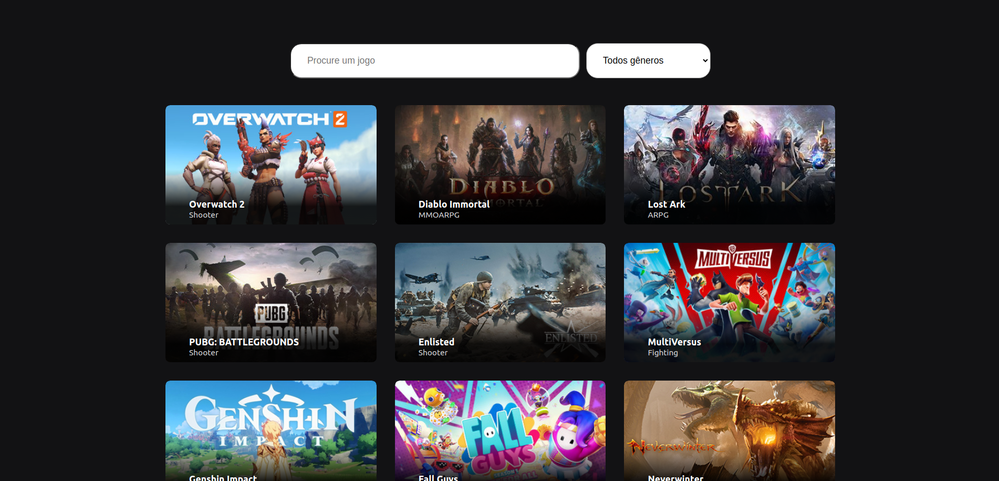
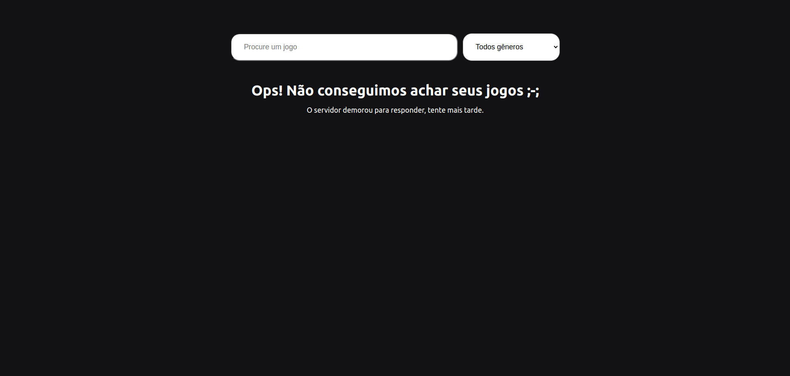

<h1 align="center">
    Desafio
</h1>

 

## Descrição

Esse projeto é um desafio, onde é necessário descobrir como funciona a API e listar os jogos em cards. Além disso, é necessário filtrar os jogos pelo nome e gênero.

Link do projeto: https://desafio-gamma.vercel.app/

## Tecnologias

Esse projeto foi desenvolvido utilizando **React.JS** e **Typescript**, além da lib **react-loading-skeleton**

## Requisitos Funcionais

- [x] O projeto deve ser feito usando React ou Next.JS
- [x] Obter a lista de jogos em /data
- [x] Apresentar um loader enquanto os dados são obtidos
- [x] Apresentar os jogos em três colunas (no computador)
- [x] Em cada card apresentar o título e imagem pelo ao menos
- [x] Lidar com a responsividade, para que fique bem apresentado no computador, tablets ou celular
- [x] Quando a API retornar o status code 500, 502, 503, 504, 507, 508 ou 509 apresentar ao usuário O servidor falhou em responder, tente recarregar a página
- [x] Caso a API retorne outros erros, apresentar O servidor não conseguirá responder por agora, tente voltar novamente mais tarde
- [x] Ao realizar uma chamada, não esperar mais que 5 segundos pelo retorno. Se os dados demorarem mais de 5 segundos para retornar apresentar O servidor demorou para responder, tente mais tarde
- [x] Sempre que apresentar uma mensagem para o usuário, ou tiver os dados em mãos para apresentar, ocultar o loader
- [x] Incluir um campo de busca, que permite localizar jogos pelo título, com busca case insensitive
- [x] Uma vez que tenha os dados em mãos, veja quais genre foram retornados e permita ao usuário selecionar um deles, e então filtre para exibir apenas jogos do gênero selecionado

 

## Abaixo seguem algumas prints de todo o projeto

 

## Contato

[![LinkedIn][linkedin-shield] ][linkedin-url]

Vinícius Latini Gonçalves - viniciuslatini2001@gmail.com

[linkedin-shield]: https://img.shields.io/badge/-LinkedIn-black.svg?style=for-the-badge&logo=linkedin&colorB=555
[linkedin-url]: https://www.linkedin.com/in/viniciuslatini/