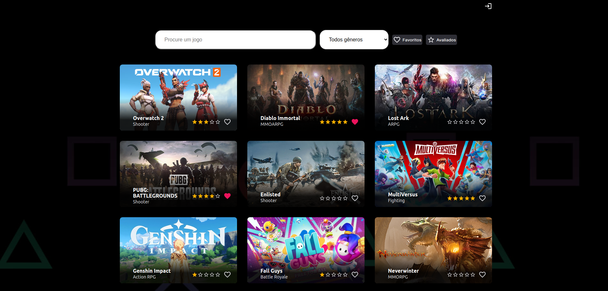

<h1 align="center">
    Desafio v2
</h1>

 

## Descrição

Esse projeto é um desafio, onde é necessário descobrir como funciona a API e listar os jogos em cards. Além disso, é necessário filtrar os jogos pelo nome e gênero.

Ademais, foi adicionada um login onde o usuário tem acesso a sua lista de jogos favoritos e avaliados.

Link do projeto: https://desafio-gamma.vercel.app/

## Tecnologias

Esse projeto foi desenvolvido utilizando **React.JS** e **Typescript**, além da lib **react-loading-skeleton**. Além disso, foi utilizado o **FireBase** para registrar as inforções do usuário

## Requisitos Funcionais (v1)

- [x] O projeto deve ser feito usando React ou Next.JS
- [x] Obter a lista de jogos em /data
- [x] Apresentar um loader enquanto os dados são obtidos
- [x] Apresentar os jogos em três colunas (no computador)
- [x] Em cada card apresentar o título e imagem pelo ao menos
- [x] Lidar com a responsividade, para que fique bem apresentado no computador, tablets ou celular
- [x] Quando a API retornar o status code 500, 502, 503, 504, 507, 508 ou 509 apresentar ao usuário O servidor falhou em responder, tente recarregar a página
- [x] Caso a API retorne outros erros, apresentar O servidor não conseguirá responder por agora, tente voltar novamente mais tarde
- [x] Ao realizar uma chamada, não esperar mais que 5 segundos pelo retorno. Se os dados demorarem mais de 5 segundos para retornar apresentar O servidor demorou para responder, tente mais tarde
- [x] Sempre que apresentar uma mensagem para o usuário, ou tiver os dados em mãos para apresentar, ocultar o loader
- [x] Incluir um campo de busca, que permite localizar jogos pelo título, com busca case insensitive
- [x] Uma vez que tenha os dados em mãos, veja quais genre foram retornados e permita ao usuário selecionar um deles, e então filtre para exibir apenas jogos do gênero selecionado

## Requisitos Funcionais (v2)

- [x] Utilizar Firebase para realizar autenticação usando email/senha
- [x] Ter um 🩶 para o usuário favoritar o jogo diretamente na lista, ficando vermelho quando marcado
- [x] Salvar no firebase os jogos favoritos do usuário, no realtime ou firestore
- [x] Ter um botão “Favoritos” que apresenta apenas jogos favoritados, permitindo ainda buscar e filtrar estes jogos. Pode ser na própria lista já apresentada ou em uma separada se preferir.
- [x] Ao lado do coração, ter ★★★★ para o usuário avaliar o jogo, podendo marcar de uma em uma. Ou seja, ele pode escolher 1, 2, 3 ou as 4.
- [x] Ter uma forma de ordenar por avaliação, vendo os melhores (ou piores) primeiro, clicando novamente para inverter a ordem.
- [x] Ao carregar a interface, deixar o ❤️ vermelho para os itens favoritos e as ⭐️ amarelas nos itens avaliados
- [x] Ao acessar sem estar autenticado, os ícones 🩶 e ★ deverão estar visíveis, mas ao clicar irá solicitar a autenticação
- [x] 👉 Ao obter os jogos da API e os dados do firebase, apresentar. Manter o loading para os jogos. Não precisa de loading enquanto espera o firebase, até porque o firebase devolverá os dados mais rapidamente e pode ser complicado “esperar o firebase” se estiver “escutando o firebase”.
- [x] A autenticação deve acontecer na rota `/auth/` do frontend, usando o provedor “E-mail/senha” do firebase, onde o usuário poderá criar uma conta ou acessar a conta já existente (se mantendo apenas nesta rota)
- [x] Escolher um item para aplicar uma animação com CSS, pode ser ao favoritar, ou avaliar, ou quando os itens surgirem
- [x] Publicar seu projeto online

 

## Abaixo seguem algumas prints de todo o projeto

 

## Contato

[![LinkedIn][linkedin-shield] ][linkedin-url]

Vinícius Latini Gonçalves - viniciuslatini2001@gmail.com

[linkedin-shield]: https://img.shields.io/badge/-LinkedIn-black.svg?style=for-the-badge&logo=linkedin&colorB=555
[linkedin-url]: https://www.linkedin.com/in/viniciuslatini/